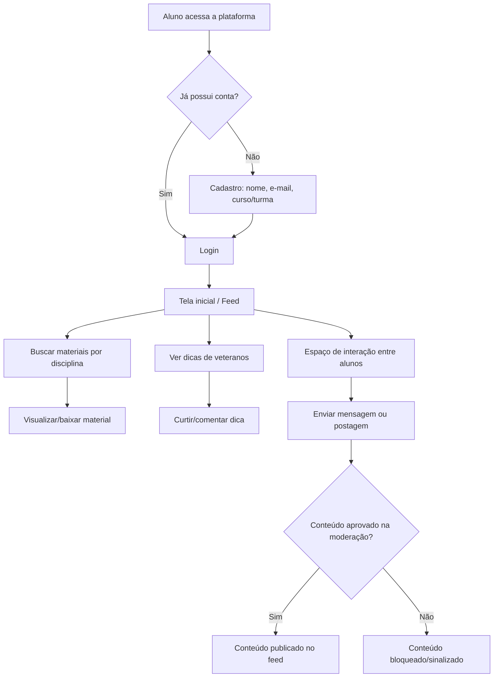
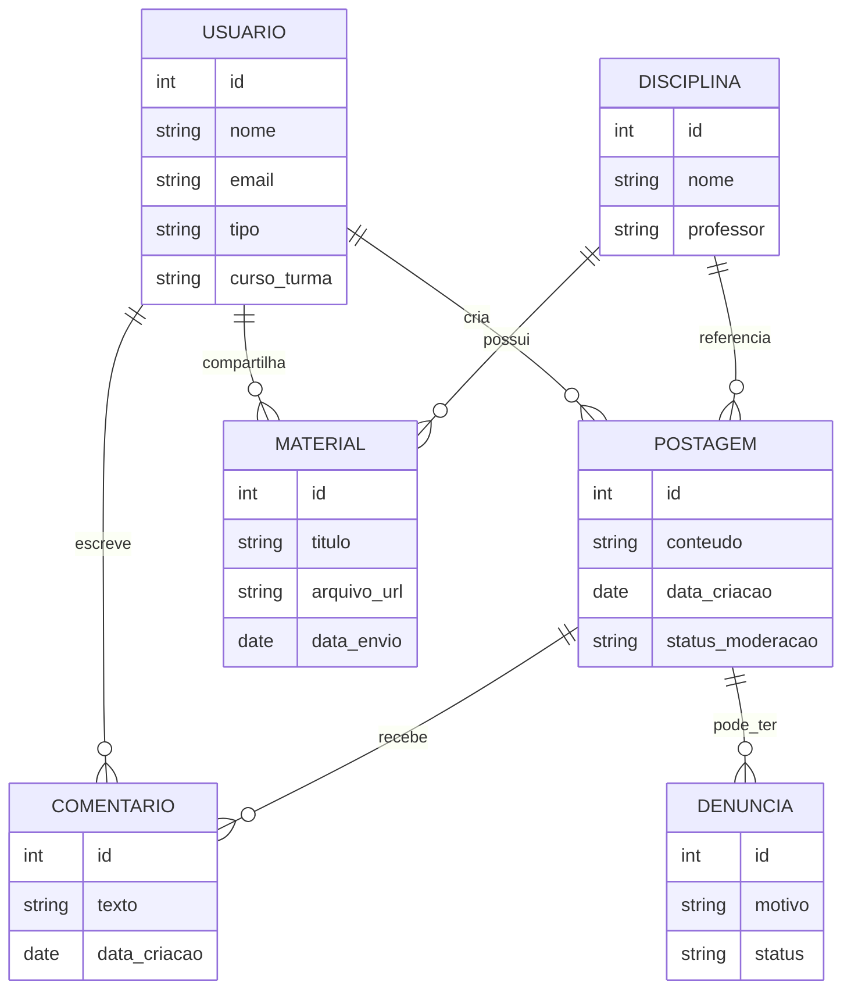

# Relatório de Arquitetura e Modelagem - ConectaCalouro

Este documento detalha a rastreabilidade do projeto, as regras de negócio, a estrutura de permissões (RBAC) e os diagramas de modelagem do sistema ConectaCalouro.

---

## 1. Rastreabilidade e Gestão Ágil

- **Quadro Kanban no Trello:** https://trello.com/b/h671ZNLU/conectacalouro-etapa2
- **Repositório e Issues no GitHub:** https://github.com/Ellentrix/ConectaCalouro/issues

---

## 2. Matriz RBAC / Regras de Negócio

Tabela de permissões dos usuários do sistema:

| Ação | Aluno Novato | Aluno Veterano | Administrador |
|---|---|---|---|
| Criar conta / login | ✅ | ✅ | ✅ |
| Visualizar materiais de disciplinas | ✅ | ✅ | ✅ |
| Compartilhar materiais de estudo | ❌ | ✅ | ✅ |
| Publicar dicas para calouros | ❌ | ✅ | ✅ |
| Comentar em postagens | ✅ | ✅ | ✅ |
| Denunciar conteúdo inadequado | ✅ | ✅ | ✅ |
| Moderar/remover conteúdo denunciado | ❌ | ❌ | ✅ |
| Gerenciar usuários | ❌ | ❌ | ✅ |

---

## 3. Regras de Negócio e Segurança

- **Publicação de Conteúdo:** Apenas alunos veteranos e administradores podem compartilhar materiais de estudo ou publicar dicas; alunos novatos podem apenas visualizar e comentar.
- **Moderação Obrigatória:** Nenhuma postagem é publicada automaticamente sem passar antes por validação do sistema de moderação de conteúdo.
- **Política de Denúncias:** Qualquer usuário pode denunciar um conteúdo, mas apenas o administrador tem permissão para removê-lo.
- **Restrição de Acesso:** Apenas o administrador possui acesso total para gerenciar usuários e alterar a estrutura do sistema.

---

## 4. Fluxograma do Processo de Uso

---

## 5. Modelo de Dados (DER)

