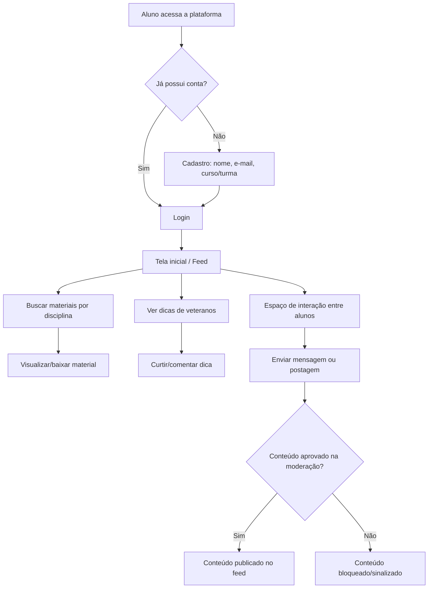
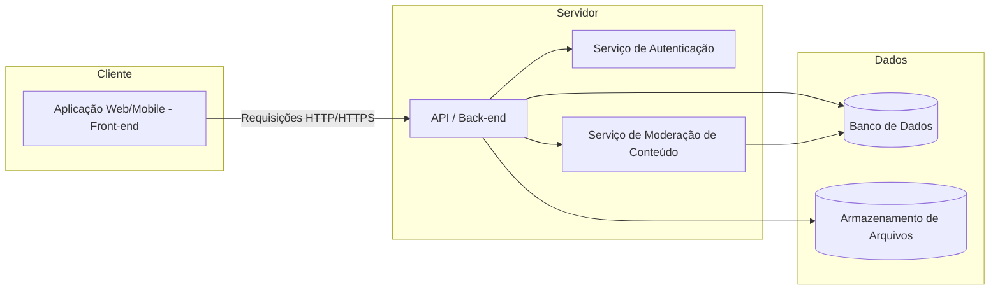
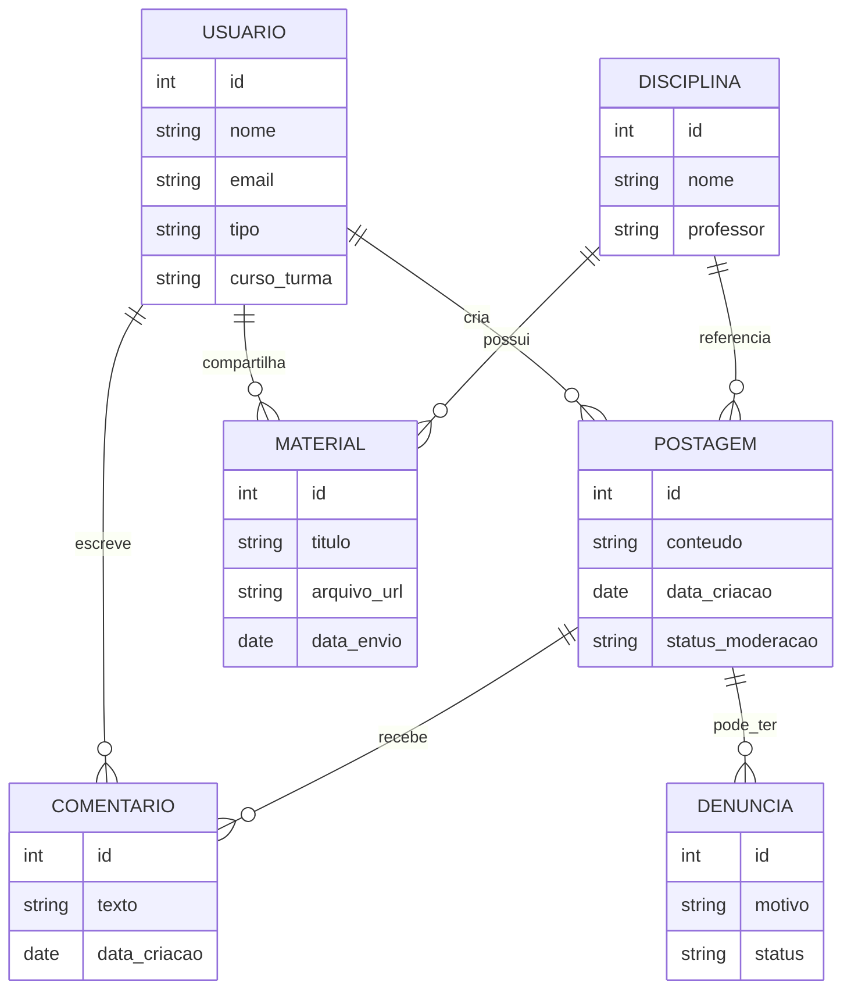

# Modelagem Inicial da Solução — ConectaCalouro

## 1. Fluxograma de Uso do Sistema

```mermaid
flowchart TD
    A[Aluno acessa a plataforma] --> B{Já possui conta?}
    B -- Não --> C[Cadastro: nome, e-mail, curso/turma]
    B -- Sim --> D[Login]
    C --> D
    D --> E[Tela inicial / Feed]
    E --> F[Buscar materiais por disciplina]
    E --> G[Ver dicas de veteranos]
    E --> H[Espaço de interação entre alunos]
    F --> I[Visualizar/baixar material]
    G --> J[Curtir/comentar dica]
    H --> K[Enviar mensagem ou postagem]
    K --> L{Conteúdo aprovado na moderação?}
    L -- Sim --> M[Conteúdo publicado no feed]
    L -- Não --> N[Conteúdo bloqueado/sinalizado]
```

## 2. Diagrama de Arquitetura da Solução

```mermaid
flowchart LR
    subgraph Cliente
        A[Aplicação Web/Mobile - Front-end]
    end

    subgraph Servidor
        B[API / Back-end]
        C[Serviço de Autenticação]
        D[Serviço de Moderação de Conteúdo]
    end

    subgraph Dados
        E[(Banco de Dados)]
        F[(Armazenamento de Arquivos)]
    end

    A -->|Requisições HTTP/HTTPS| B
    B --> C
    B --> D
    B --> E
    B --> F
    D --> E
```

## 3. Modelo de Dados (Entidade-Relacionamento)

```mermaid
erDiagram
    USUARIO ||--o{ POSTAGEM : cria
    USUARIO ||--o{ COMENTARIO : escreve
    USUARIO ||--o{ MATERIAL : compartilha
    DISCIPLINA ||--o{ MATERIAL : possui
    DISCIPLINA ||--o{ POSTAGEM : referencia
    POSTAGEM ||--o{ COMENTARIO : recebe
    POSTAGEM ||--o{ DENUNCIA : pode_ter

    USUARIO {
        int id
        string nome
        string email
        string tipo
        string curso_turma
    }
    DISCIPLINA {
        int id
        string nome
        string professor
    }
    MATERIAL {
        int id
        string titulo
        string arquivo_url
        date data_envio
    }
    POSTAGEM {
        int id
        string conteudo
        date data_criacao
        string status_moderacao
    }
    COMENTARIO {
        int id
        string texto
        date data_criacao
    }
    DENUNCIA {
        int id
        string motivo
        string status
    }
```
